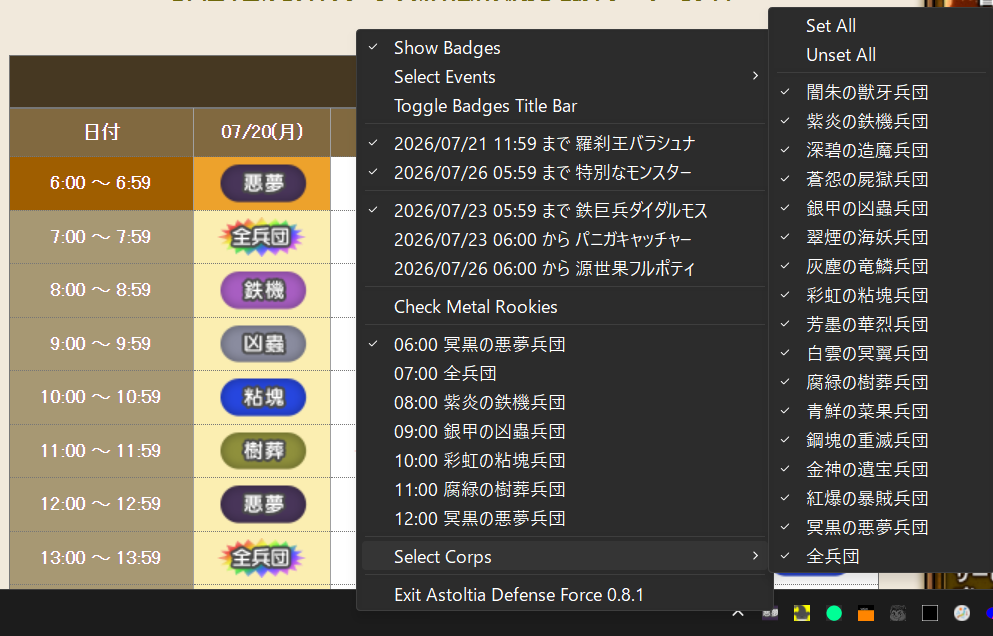

# ADFmonitor

現在のアストルティア防衛軍の襲撃兵団をお知らせ



・メタルーキー軍団の大行進スケジュール
・天獄
・フェスタ・インフェルノ
・昏冥庫パニガルム
・異界の創造主
・まもの博士の冒険的な実験
・源世庫パニガルム

の状況を確認することができます

## About

Windows のタスクトレイに常駐して現在襲撃中の兵団を手軽に知ることができます

- アイコンにマウスカーソルを乗せると選択した兵団のスケジュールをツールチップに表示します
- アイコンを左クリックするとつよさ予報のページを開きます
- アイコンを右クリックすると現在以降のスケジュールを表示します
- 選択した兵団(デフォルトは紫炎の鉄機兵団・冥黒の悪夢兵団・全兵団)が始まるとWindowsの通知センターでお知らせします

## Badge について


防衛軍とそれ以外の情報をデスクトップに表示します

- 天獄・フェスタインフェルノ・昏冥庫パニガルム・異界の創造主・冒険的な実験の開催状況
- 源世庫パニガルムのボスと予告
- 防衛軍のボスと予告

画像をドラッグで移動・右クリックで縦横切り替え・'f'キーで拡大表示のトグルができます

タイトルバーを表示することで OBS Studio などでウィンドウキャプチャができるようになります

## Run

[Release ページ](https://github.com/sharl/ADFmonitor/releases/latest) から zip で圧縮した Windows 用実行ファイルをダウンロードして実行してください

ソースコードから実行したい場合は以下の手順を参照してください

```
git clone https://github.com/sharl/ADFmonitor.git
cd ADFmonitor
python -m venv .venv
.\.venv\Scripts\activate
pip install -r requirements.txt
python ADFmonitor.py
```

## icon
Drawn by Microsoft Copilot

アイコン募集中です

## sound
【効果音】風鈴の音１＿チリン - ニコニ・コモンズ
https://commons.nicovideo.jp/works/nc308516
