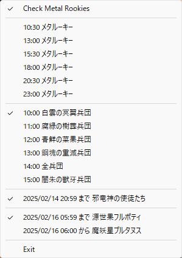

# ADFmonitor

現在のアストルティア防衛軍の襲撃兵団をお知らせ



メタルーキー軍団の大行進スケジュール・天獄・源世庫パニガルム・昏冥庫パニガルムも確認できるようになりました

## Run

```
git clone https://github.com/sharl/ADFmonitor.git
cd ADFmonitor
pip install -r requirements.txt
python ADFmonitor.py
```

## icon
Drawn by Microsoft Copilot

アイコン募集中です

## sound
【効果音】風鈴の音１＿チリン - ニコニ・コモンズ
https://commons.nicovideo.jp/works/nc308516
